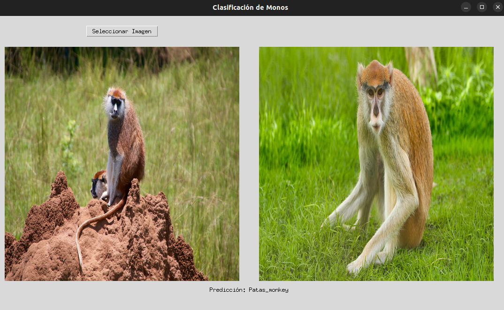
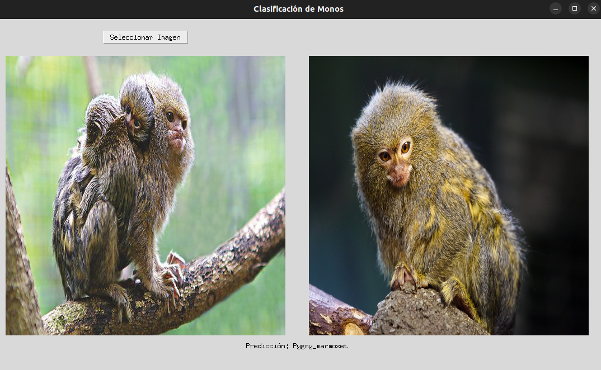
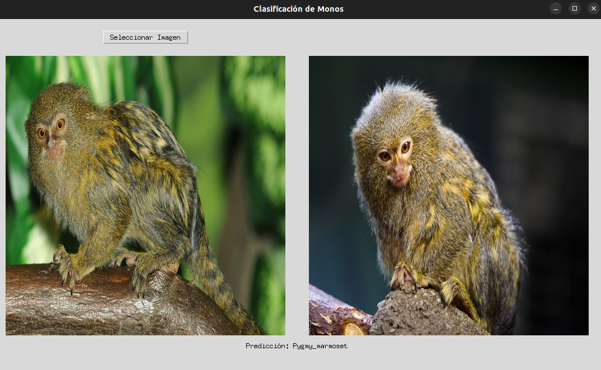

# Clasificación de Imágenes de Monos con PyTorch

Este repositorio contiene una solución para clasificar imágenes de diferentes especies de monos utilizando una red neuronal implementada en PyTorch.

## Requisitos

Para ejecutar los scripts, se requiere Python 3.x junto con las siguientes bibliotecas principales:

- PyTorch
- Torchvision
- tkinter
- PIL
- Matplotlib
- NumPy

Puede instalar estas dependencias utilizando pip:

```bash
pip install torch torchvision tkinter matplotlib numpy
```


## Información Adicional

Este código está adaptado tanto para usar una tarjeta gráfica compatible con CUDA como para ejecutarse en CPU. Se recomienda encarecidamente utilizar CUDA si está disponible, ya que la red neuronal fue entrenada con este fin.

## Instrucciones de Uso

1. **Calcular Media y Desviación Estándar**: Ejecute `python3 src/std_mean.py` (solo si se modifican los datos de entrenamiento) para calcular la media y la desviación estándar del conjunto de datos de entrenamiento.
   
2. **Entrenar la Red Neuronal**: Copie los resultados obtenidos y pégalos dentro de `train.py`. Ejecute `python3 src/train.py` (solo si desea re-entrenar la red neuronal; cambie el número de iteraciones en el código si es necesario).
   
3. **Interfaz Gráfica de Clasificación**: Ejecute `python3 src/interfaz.py` para iniciar la interfaz gráfica de clasificación de imágenes de monos.

## Capturas de Funcionamiento





## Descripción de los Scripts

1. `train.py`: Script para entrenar la red neuronal utilizando los datos de entrenamiento proporcionados. También guarda el mejor modelo obtenido durante el entrenamiento.
   
2. `interfaz.py`: Script para ejecutar una interfaz gráfica que permite al usuario cargar una imagen y clasificarla utilizando el modelo pre-entrenado.
   
3. `std_mean.py`: Script para calcular la media y la desviación estándar del conjunto de datos de entrenamiento, necesarios para la normalización de datos durante el entrenamiento.
   
4. `functions.py`: Contiene funciones auxiliares utilizadas en los otros scripts, como la función para clasificar una imagen y la función para encontrar el mejor modelo en una carpeta.
   
5. `utils.py`: Contiene funciones de utilidad, como la función para establecer el dispositivo de cálculo (CPU o GPU) y la función para guardar un punto de control del modelo durante el entrenamiento.

## Agradecimientos

Agradecemos al autor del conjunto de datos necesario para el entrenamiento. Los datos utilizados en este proyecto fueron obtenidos de [este conjunto de datos en Kaggle](https://www.kaggle.com/datasets/slothkong/10-monkey-species).
